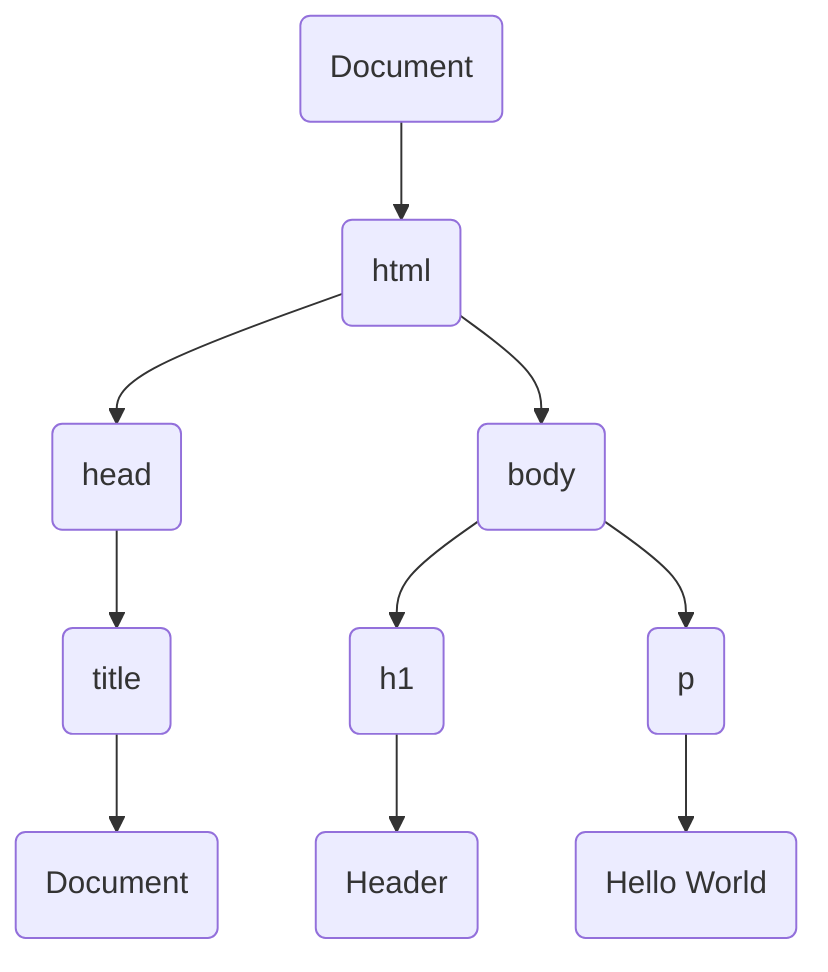

# DOM
## what is DOM?
=> The Data Object Model(DOM) is an interface for web documents. It represents the page so that programs can change the document structure, style and content. The DOM represents the document as node and objects; that way programming languages can interact with the page.

## Why DOM is needed?
=> A web page is document that can be either displayed as a window or as an HTML source. The DOM representation allows it to be manipulated. It makes a webpage interactive with the user.

## DOM tree:- 
=> A DOM tree is a tree structure, whose nodes represents an HTML documents contents. Every HTML document has a DOM tree representation.

### Example:-

```html
<html>
	<head>
		<title>Document</title>
		<body>
			<h1>Header</h1>
			<p>Hello World</p>
		</body>
	</head>
</html>
```



## Who runs JavaScript in browser?
=> Browser engine runs JS in browser.

