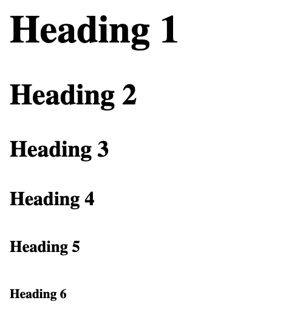

# My Learnings 📖

## List of contents

1. [tags](#tags)
2. [Attributes](#attributes)
3. [Construction](#basic-construction-of-an-html-page)
4. [Various types of tags](#various-types-of-tags)
    * [Heading](#headings-tags)
    * [Paragraph](#paragraph-tag)
    * [bold](#bold)
    * [Italic](#italic)
    * [Underline](#underline)
    * [Break](#break)
    * [List](#List)

5. [responsiveness](responsiveness.md)
6. [dom](dom.md)
## tags

- Tags are used to mark up the start of an HTML element and they are usually enclosed in angle.
- types of tags: 
  * opening tags: `<html>`
  * closing tags: `</html>`

## Attributes

- Attributes contain additional pieces of information. Attributes take the form of an opening tag and additional info is placed inside.

### Example:

```html
<p style ="font-size: 20px">
```
here `style` is an attribute.

## Basic construction of an HTML page

- `<html>` - This tag signals that from here on we are going to write in HTML code. After finishing the code we have close the tag by `</html>` closing tag.

- `<head>` - This element is a container for metadata. Metadata typically define the document title, character set, styles, scripts, and other meta information. After finishing **head** we have to close it by `</head>` tag.

- `<title>` - HTML title tag is used to provide a title name for your webpage. After giving title we have to close it by `</tile>`.

- `<body>` - This is the main and visual part of HTML. The `<body>` element contains all the contents of an HTML document, such as headings, paragraphs, images, hyperlinks, tables, lists, etc.

### Example: 

```html
<html>
  <head>
    <title>Example</title>
  </head>
  <body>
    Hello World
  </body>
</html>
```

## Various types of tags:

## Headings tags:

- These tags are used to add headings to any topic. There are six sizes of Heading tags-

### Example:

```html
<h1>Heading 1</h1>
<h2>Heading 2</h2>
<h3>Heading 3</h3>
<h4>Heading 4</h4>
<h5>Heading 5</h5>
<h6>Heading 6</h6>
```

### Output:



## Paragraph Tag:

- The `<p>` tag defines a paragraph. Browsers automatically add a single blank line before and after each `<p>` element.

### Example: 

```html
<html>
  <body>
    <p>This is a paragraph.</p>
    <p>This is another paragraph.</p>
  </body>
</html>
```

## Bold:

- `<b>` tag is used to make any text bold.
- We have to keep the section inside `<b>` `</b>` tags

### Example:
```html
<b>This is bold text</b>
```

## Italic:

- `<i>` tag is used to make any text italic format.

### Example:
```html
<i>This is for italic.</i>
```

## Underline:
- `<u>` tag is used to underline any text.

### Example:
```html
<u>This is underlined text</u>
```

## Break:
- `<br/>` Tag is used for new line. Normally in a single paragraph **HTML** doesn't understand new line by pressing enter key.
- this doesn't have any closing tag.

### Example:
```html
<p>
  This is a line.<br/>
  This is in next line.
</p>
```

## List:

- There are two types of list.
  * Ordered list: `<ol>`
  * Unordered list: `<ul>`

- To add items to the list we have to use `<li>` tag.

### Example:

```html
<ol>
  <li>Mango</li>
  <li>Orange</li>
  <li>Banana</li>
</ol>
```
This is ordered list.

```html
<ul>
  <li>Mango</li>
  <li>Orange</li>
  <li>Banana</li>
</ul>
```
This is unordered list.

